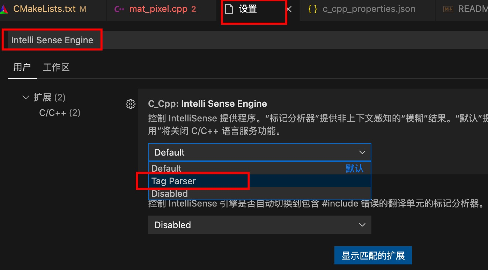

## 0x1 准备

我觉得一套齐全的工具包括而不限于：
GUI软件：VSCode, CLion, SourceTail, AndroidStudio, SmartGit;
编译器：NDK-r21b; Clang / VS2019
命令行：cmake, git, tig, ag

ARM NEON 的几个入门帖：
- https://blog.csdn.net/Roland_Sun/article/details/42921131
- https://blog.csdn.net/emsoften/article/details/51718763
- https://aijishu.com/a/1060000000116427

对应代码：以ncnn第一次git commit为主，有编译问题简单修复。

**vscode设置**

这里对 VSCode 的设置做说明：怎样让它识别 `__ARM_NEON`宏，代码不要灰色显示？怎样跳转到`vld3_u8`这样的宏/函数定义？

<del>step1: cmake版本</del>

<del>确保cmake版本>3.9，如果有Python环境，可以`pip install cmake`快速安装</del>

推荐 cmake > 3.15 的版本，不过 @OFshare 测试发现低于3.9也可以用。

step2: 生成 compile_commands.json 文件

CMakeLists.txt里添加`set(CMAKE_EXPORT_COMPILE_COMMANDS ON)`，或调用cmake时传入`-DCMAKE_EXPORT_COMPILE_COMMANDS=ON`

step3: VSCode 插件

确保安装3个插件：C/C++, CMake, <del>CMake Tools</del>

经过 @OFshare 测试，CMake Tools不是必要的。

step4: 改 c_cpp_properties.json

添加一个NDK的配置项。最重要的是编译器路径，以及指定`"intelliSenseMode": "clang-arm64"`。

例如在Windows下我的配置：
```json
{
    "configurations": [
        {
            "name": "Win32",
            "includePath": [
                "${workspaceFolder}/**"
            ],
            "defines": [
                "_DEBUG",
                "UNICODE",
                "_UNICODE"
            ],
            "windowsSdkVersion": "10.0.18362.0",
            "compilerPath": "C:/Program Files (x86)/Microsoft Visual Studio/2019/Community/VC/Tools/MSVC/14.28.29333/bin/Hostx64/x64/cl.exe",
            "cStandard": "c17",
            "cppStandard": "c++17",
            "intelliSenseMode": "msvc-x64",
            "compileCommands": "${workspaceFolder}/build/vs2019-x64/compile_commands.json"
        },
        {
            "name": "NDK-r21b",
            "includePath": [
                "${workspaceFolder}/**"
            ],
            "defines": [],
            "compilerPath": "E:/soft/Android/ndk-r21b/toolchains/llvm/prebuilt/windows-x86_64/bin/clang++.exe",
            "cStandard": "c11",
            "cppStandard": "c++11",
            "intelliSenseMode": "clang-arm64",
            "compileCommands": "build/android-arm64/compile_commands.json"
        }
    ],
    "version": 4
}
```
然后VSCode里打开任意一个.h/.c/.cpp文件，右下角状态栏选择NDK-r21b


或者，关掉VSCode，删除.vscode目录，重新打开，过几秒会自动弹窗提示选择compile_commands.json文件：


只不过这种情况下，`c_cpp_properties.json`里的编译器可能还是x86平台的编译器而不是NDK里的。

step5: 消除红色波浪线

Linux和早些时候的Windows上，VSCode不识别`__fp16`和`vld3_u8`等关键字，显示为红色波浪下划线。

VSCode->文件->首选项->设置，搜索 `Intelli Sense Engine`，把 `Default` 改成 `Tag Parser`，红色波浪线就消失了！


（其实是Intelli Sense的Parser的问题，https://github.com/microsoft/vscode-cpptools/issues/6506）